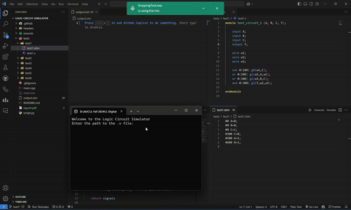

# Logic-Circuit-Simulator

This C++ event-driven logic circuit simulator processes a circuit defined in a Verilog file and external events specified in a .stim file, generating a .sim file that captures the changes in the circuit's signals. Additionally, a Python script is utilized to visualize the waveforms and signal changes.


<div align="center">



</div>

## Tech Stack

- 
- 

## Features

### Data Structures

- **Priority Queue:** It is a min-heap priority queue, it stores events based on their timestamps. It was implemented such that earlier events are processed first, which allows the simulation to run in the correct order.
- **Vector of Gates:** We implemented this vector such that it stores all the gate objects in the circuit. It allows us to go through and make any necessary changes in the gate's output while the circuit’s state changes during the simulation. 
- **Map for different signal values:** This map matches each signal with each binary value. It keeps track of the current state of each signal, using the signals’ names as keys. We made each signal start with -999 as a default value which means that the state of the signal is unknown for now. It gets changed afterward with an assigned real value. This map tells us the latest signal values throughout the simulation. 
- **Event and Gate Objects:** The event objects store the necessary information about each event including the event time, the signal name, and the new value assigned to it. Each event is a change in the circuit which will be then added to the priority queue based on its timestamp. The gate objects represent every logical gate like AND, OR, and NOT, their inputs, and outputs in addition to their delays. Each gate object then gets added to the vector of the gates we mentioned earlier. 

### Algorithms

- **File Parsing:** In the project, we need to do file parsing in two situations, the first one is to parse the .v file to extract the necessary information about the gates, and the second one is to parse the .stim file to get the events data. For the .v file reading, we went through each line in the file ignoring the empty lines, the lines that start with module, or endmodule, we then got the first words of the remaining lines to be the gates types, and after that, we extracted the inputs using regular expressions library, and then got the outputs and pushed them into the output vector, and we did the same with the delays as well and used this information to create Gate objects and populate the gates vector. Similarly, we used some helping functions to extract the timestamps, the input names, and the new values from the .stim file and populate the priority queue. 
- **Gate Evaluation:** The purpose of this is to compute the output of each gate based on its logical function and current input values. The steps we used in this are as follows, first, we checked the map of the signal values to get the current state of the gate inputs, and then based on the type of the gate the function performs the corresponding logical operation. And finally, it returns the output we got which allows the simulation to refresh the circuit with any new state updates.
- **Simulation:** It simulates by processing the events in chronological order. First, it pops the earliest event from the priority queue and updates the signal values in the map. It keeps on doing this for all the events in the priority queue. If, at any time, the signal value differs from its previous state, the refreshGateOutpus function gets called to modify the gate's output accordingly. It keeps on doing this until the priority queue is empty. 

For more details, please refer to the [report.pdf](report.pdf) file.

## Run Locally

Clone the project

```bash
  git clone https://github.com/AdhamElRouby/Logic-Circuit-Simulator.git
```

Go to the project directory

```bash
  cd .\Logic-Circuit-Simulator
```

Open with VSCode

```bash
  code .
```

Compile and run the C++ program

```bash
  g++ main.cpp -o simulator && ./simulator
```

Run the Python script to visualize the waveforms

```bash
  python script.py
```


## Contributing

We welcome contributions to this project! Feel free to submit pull requests and suggest improvements. 
If you have any questions or need assistance, don’t hesitate to contact me at adhamelrouby@aucegypt.edu.


